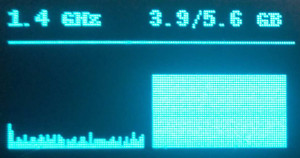
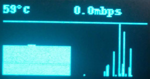
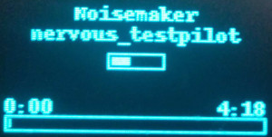
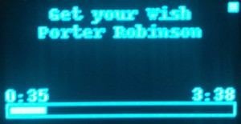

# smbus-ssd1306
Why not use an SSD1306 OLED module as a metadata display for my laptop? That's exactly what I thought and that's exactly how this project came to be. It's intended to control an SSD1306 display connected straight to the System Management Bus, or SMBus for short.\
**Warning:** Linux-only!

## Features
  - Multiple screens with different information
  - Framework to add custom screens
  - Global screen switching using `Ctrl+Alt+{ScreenNo}`
  - Automatic screen switching suspension using `Ctrl+Alt+F`
  - Media playback info through D-Bus

#### Screens
  1. CPU frequency, CPU load graph, RAM usage, RAM usage graph\
     
  2. CPU package temperature, CPU temp graph, network download speed, net graph\
     
  3. Media playback: song title, artist, auto-rating, time, song length. **Note:** Spotify is not sending correct playback time information (at least the version I have installed doesn't). Unfortunately, I can't do anything about this. When using Spotify the playback time is always going to report `0:00`.\
     \
     Spotify media playback data\
     \
     VLC media playback data
  4. current CPS and peak CPS measurement: either mouse clicks, `z` and `x` strokes or both (switch with `Ctrl+Alt+O`, reset peak with `Ctrl+Alt+R`)

## Setup
  1. Acquire an SSD1306 module that's wired to use the I2C interface.
  2. Find a schematic (and, preferably, a boardview) for your motherboard. If you can't find any, please consider supporting [Right to Repair](https://www.repair.org/stand-up/).
  3. Find a convenient place to connect to the system SMB interface. The interface consists of two data lines: SDA (or DAT) and SCL (or CLK). My motherboard has three SMB interfaces coming out of the PCH, so I found the main one. There is also a whole host of other I2C interfaces you may find on your board. I tried some of them, but `i2cdetect` wasn't able to detect the display on any of them.
  4. Trace the schematic and make sure that these two lines are pulled up with a (probably 4.7kOhm) resistor to 3.3V as that's the voltage level the display is expecting.
  5. Find a power rail to power the display with. Those convenient blue modules feature an onboard 5V-to-3.3V charge pump, so if you're using one find a 5V rail. Otherwise find a 3.3V power rail. **Note:** some power rails are labeled `SUS`, which stands for "suspend" and has, in fact, nothing to do with the slang terms used by many 2018 multiplayer social deduction videogame "Among Us" players. You probably don't want to use them as they're active even while the computer is powered down.
  6. Connect your display to those pins.
  7. Run `i2cdetect 0` (from the `i2c-tools` package on most distros) and check if it has found a device at address `0x3C` or `0x3D` - that's the display address. If not:\
     7.1. run `i2cdetect -l` to list all I2C adapters, try all of them and see if the display shows up on any of them;\
     7.2. check your wiring and try again.
  8. Tweak the configuration (see below)
  9. Make yourself the owner of the adapter virtual file: `sudo chmod $USER /dev/i2c-0` (or another number, refer to step 7)
  10. Run! `python3 main.py` or `chmod +x main.py && ./main.py`

## Configuration
Look in `config.py` for these variables
  - `I2C_ADAPTER`: adapter number. Probably 0, but may be something else. Please refer to step 7 in `Setup`
  - `SSD1306_ADDR`: display address. Probably `0x3C`, but may also be `0x3D`
  - `SCREEN_SWITCH_PERIOD`: the display will switch between different screens that many seconds apart
  - `MEDIA_PROVIDERS`: applications to try grabbing media playback data from using D-Bus
  - `ACCESS_DBUS_AS`: uid to access the D-Bus as

## Usage
The program should be run with root privileges:
```
# either one
sudo python3 main.py
sudo ./main.py
```
If you just want it to clear the screen and exit, pass `blank` (useful for pre-shutdown and pre-suspend scripts):
```
# either one
sudo python3 main.py blank
sudo ./main.py blank
```

## Full automation tutorial (systemd)
  1. Create `/etc/systemd/system/ssd1306.service`:
     ```
     [Unit]
     Description=SSD1306 control software
     After=network.target

     [Service]
     Type=simple
     WorkingDirectory=/path/to/smbus-ssd1306
     # change the :1 on the next line to your display number
     Environment="DISPLAY=:1"
     # change the 0 on the next line to the I2C adapter
     # change "username" on the next line to your username
     ExecStart=sh -c "chown username /dev/i2c-0 && sudo --user username xhost local:root && python3 /path/to/smbus-ssd1306/main.py"
     ExecStop=/path/to/smbus-ssd1306/main.py blank
     Restart=on-failure

     [Install]
     WantedBy=multi-user.target
     ```
  2. Start and enable the service:
     ```
     sudo systemctl start ssd1306
     sudo systemctl enable ssd1306
     ```
  3. Create `/usr/lib/systemd/system-sleep/ssd1306`:
     ```
     #!/usr/bin/bash
     if [ "${1}" == "pre" ]; then
       systemctl stop ssd1306
     elif [ "${1}" == "post" ]; then
       systemctl start ssd1306
     fi
     ```
  4. ...and make it executable:
     ```
     sudo chmod +xxx /usr/lib/systemd/system-sleep/ssd1306
     ```