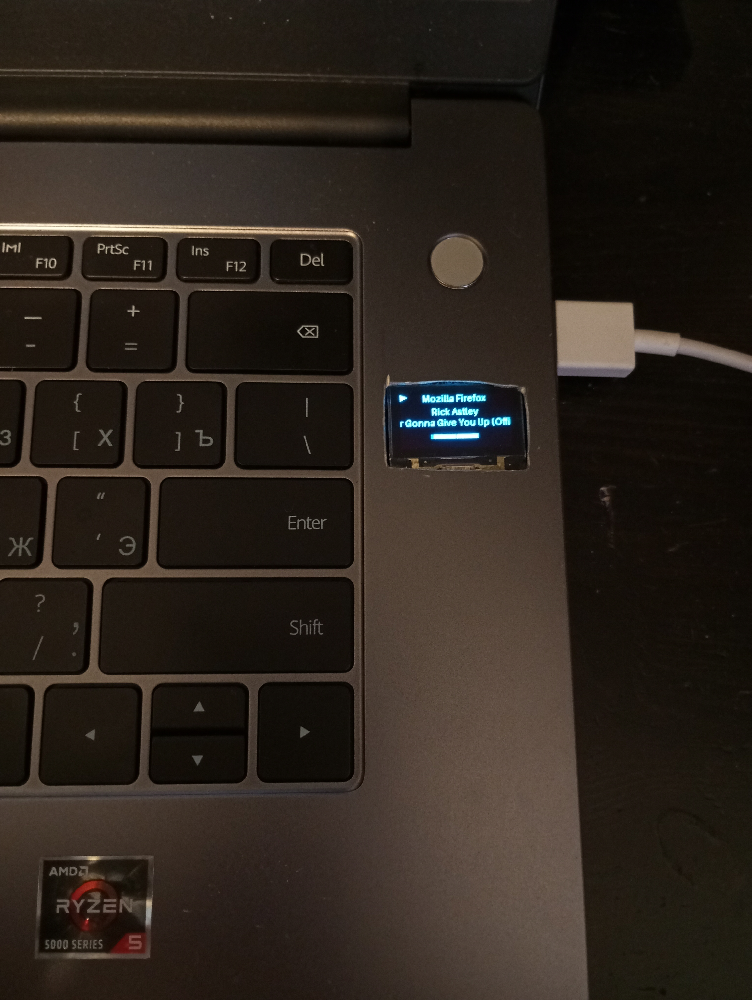
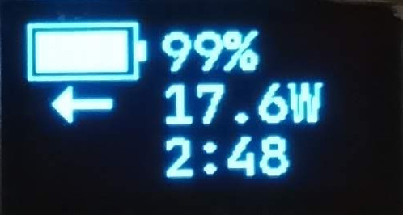

# smbus-ssd1306
Do **YOU** want to have an SSD in your personal computer or laptop? Yeah you do.
I'm of course talking about the SSD1306, a small OLED display controller which
is able to communicate with a host microcontroller via
[I2C](https://en.wikipedia.org/wiki/I%C2%B2C) or
[SPI](https://en.wikipedia.org/wiki/Serial_Peripheral_Interface). This project
uses I2C.



**Q**: _Microcontroller? Weren't we talking about a full-blown computer?_\
**A**: Your computer actually has multiple I2C buses. For example, mine has 7.

**Q**: _Did you really cut an ugly hole in your laptop for this?_\
**A**: Yes.

⚠️ **Warning:** This project is Linux-only and requires some electronics
knowledge. You are going to have to solder wires to your motherboard and connect
a device which it does not expect to it! I am not responsible for any damage.

This version is a complete rewrite of the one I initially created 2 years ago.
At about that time, I got a new laptop and thought that I'd install a display in
it once the first breakdown occurs, since it wouldn't be a shame if I end up
breaking it some more while installing the upgrade. Well, it has, so I
resurrected the project!

## Features
  - Multiple screens with different information
  - Framework to add custom screens
  - Works with slow buses (100 kHz)
  - Control over D-Bus

### Built-in Screens
  1. Power: battery percentage, charge/discharge status, wattage, time to
     empty/full

     

  2. Media: source, status, artist, title, time, length, VU meter

     
     

  3. Cute New year animation

  3. Sleep: moving "zzz" symbol when system is asleep

## Setup
  1. Acquire an SSD1306 module that's wired to use the I2C interface.
  2. Find a schematic (and, preferably, a boardview) for your motherboard. If
  you can't find any, please consider supporting
  [Right to Repair](https://www.repair.org/stand-up/).
  3. Find a convenient place to connect to an SMB or I2C interface. It consists
  of two data lines: SDA (or DAT) and SCL (or CLK). You might have to try
  several of them before `i2cdetect` is able to detect a display on one. The
  most straightforward one to find is the external DDC (Display Data Channel) on
  HDMI, DVI and VGA connectors (DP doesn't have one).
  4. Find a power rail to power the display with. Those convenient blue modules
  feature an onboard 5V-to-3.3V regulator, so if you're using one find a 5V
  rail. Otherwise find a 3.3V power rail. **Note:** some power rails are labeled
  `SUS`, which stands for "suspend" and has, in fact, nothing to do with the
  slang terms used by many 2018 multiplayer social deduction video game
  "Among Us" players. You probably don't want to use them as they're active even
  while the computer is powered down.
  5. Connect your display to those pins.
  6. Run `i2cdetect 0` (from the `i2c-tools` package on most distros) and check
  if it has found a device at address `0x3C` or `0x3D` - that's the display. If
  not:\
     6.1. run `i2cdetect -l` to list all I2C adapters, try all of them and see
     if the display shows up on any of them;\
     6.2. check your wiring and try again.
  7. Clone this repo and install its dependencies (`poetry install`)
  8. Tweak the configuration in `config.py`
  9. Run! `poetry run python main.py`

## Usage
Normal operation:
```
$ poetry run python main.py
```

If you just want it to clear the screen and exit, pass `blank` (useful for
pre-shutdown scripts):
```
$ poetry run python main.py blank
```

### Example Systemd Unit
  1. Create `/usr/lib/systemd/user/ssd1306.service`:
     ```
     [Unit]
     Description=SSD1306 control software
     Requires=dbus.service
     After=dbus.service

     [Service]
     Type=simple
     WorkingDirectory=/path/to/smbus-ssd1306 # <-- change this
     Environment="DISPLAY=:1"
     ExecStart=sh -c "poetry run python main.py"
     ExecStopPost=sh -c "poetry run python main.py blank"
     Restart=on-failure
     Slice=session.slice

     [Install]
     WantedBy=default.target
     ```
  2. Start and enable the service:
     ```
     systemctl --user enable ssd1306 --now
     ```

### Control Over D-Bus
  - Service: `ru.psi3.ssd1306`
  - Object path: `/ru/psi3/ssd1306/screens`
  - Interface: `ru.psi3.ssd1306.Screen`
    - `Overtake(number, duration)`, type `ii` displays screen number `number`
      for `duration` ms
    - `SwitchPin()` pins or unpins the currently displayed screen

### Make Your Own Screen
TODO
